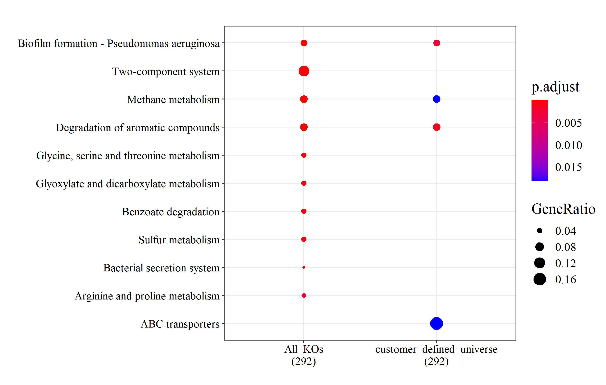

```{r, include = FALSE}
knitr::opts_chunk$set(
  collapse = TRUE,
  comment = "#>"
)
```

## 1.Overview of MicrobiomeProfiler

`MicrobiomeProfiler` is a functional enrichment tool for microbiome data based `clusterProfiler`. It is an R/shiny package with user-friendly interface.

## 2.Getting Started Quickly

Run the application:
```
library(MicrobiomeProfiler)
run_app()

```

## 3.Supported Analysis

Also, `MicrobiomeProfiler` provides several enrich functions for optional analysis.

+ KEGG enrichment analysis
+ COG enrichment analysis
+ Microbe-Disease enrichment analysis
+ Metabo-Pathway analysis

There are four reference gene catalogs collected from publications can be used as universe for KEGG analysis in specific scenarios.

| Reference Gene Catalog | Description |
| ----------- | ----------- |
| human_gut2014 | Integrated non-redundant gene catalog of human gut microbiome published on Natrue Biotechnology in 2014 |
| human_gut2016   | Integrated non-redundant gene catalog of human gut microbiome published on Cell Systems in 2016 |
|human_skin |Integrated human skin microbial non-redundant gene catalog | |
|human_vagina | a comprehensive human vaginal non-redundant gene catalog (VIRGO) that includes 6751 KEGG orthology|


## Annotation database

`MicrobiomeProfiler` has utilized four database.

+ KEGG database: Kyoto Encyclopedia of Genes and Genomes
+ COG database: Clusters of Orthologous Groups of proteins
+ Disbiome: Linking microbiome to disease
+ SMPDB: The Small Molecule Pathway Database

## Case Study
**Comparative functional KEGG enrichment analysis between Lung Microbioe in IPF and Healthy Individuals**

295 significantly differential KEGG orthologs between Lung Microbioe in idiopathnic pulmonary fibrosis Patients (IPF) and healthy individuals were reported for KEGG enrichment analysis. Here using customer-defined universe will get more demanding results.

**Parameter Sets:**

| Parameter&nbsp;              | IPF results with all KOs (left)&nbsp; | IPF results with customer-defined universe (right)&nbsp; |
| :--------------------------- | ------------------------------------- | -------------------------------------------------------- |
| Universe Gene Set:&nbsp;     | ko&nbsp;                              | customer-defined universe: 2706 KOs&nbsp;                |
| pvalue cutoff:&nbsp;         | 0.05&nbsp;                            | 0.05&nbsp;                                               |
| p.adjust method:&nbsp;       | BH&nbsp;                              | BH&nbsp;                                                 |
| p.adjust value cutoff:&nbsp; | 0.05&nbsp;                            | 0.05&nbsp;                                                   |

```{r, echo=FALSE, fig.width = 20, dpi=600, fig.align="center", fig.cap="**Comparative functional KEGG enrichment analysis results**"}

```

