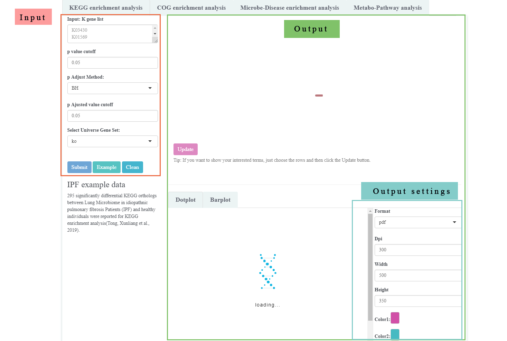
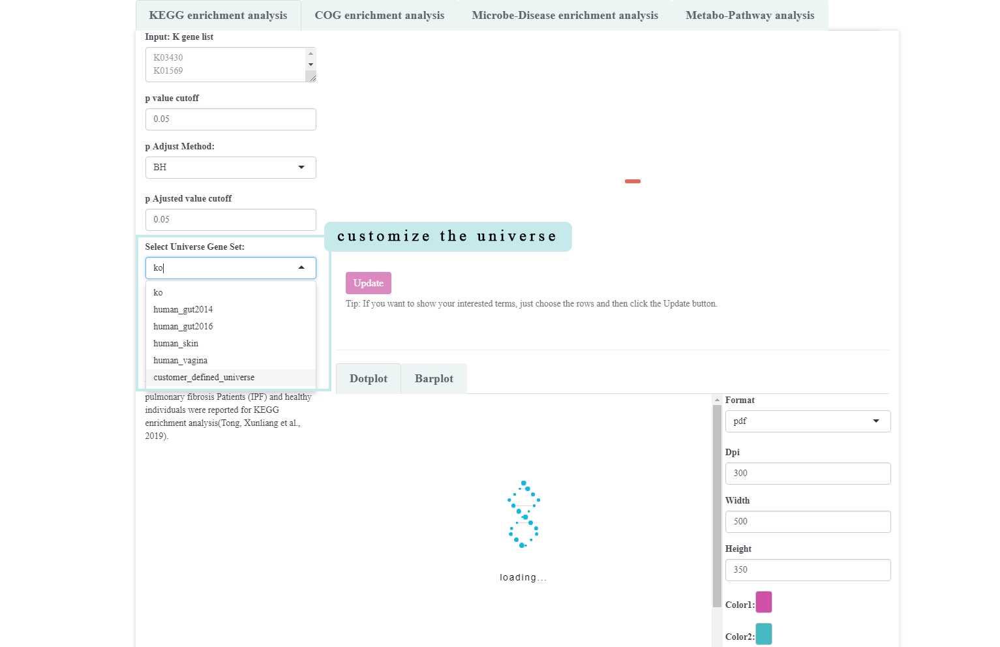
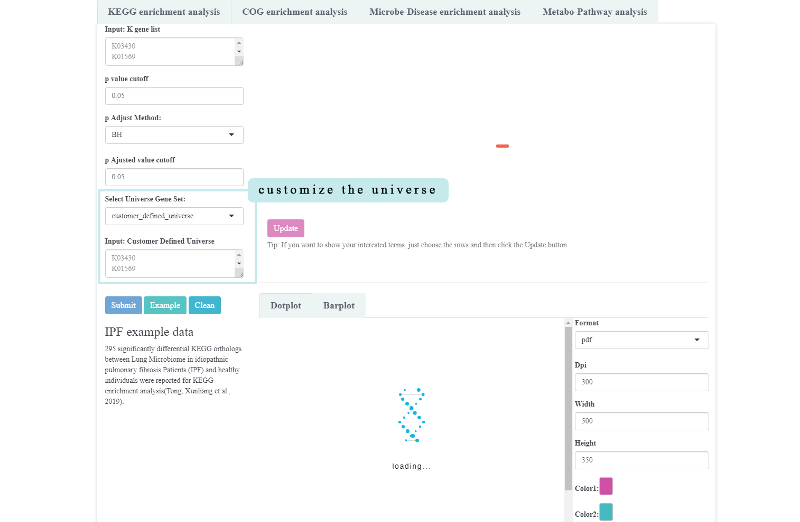
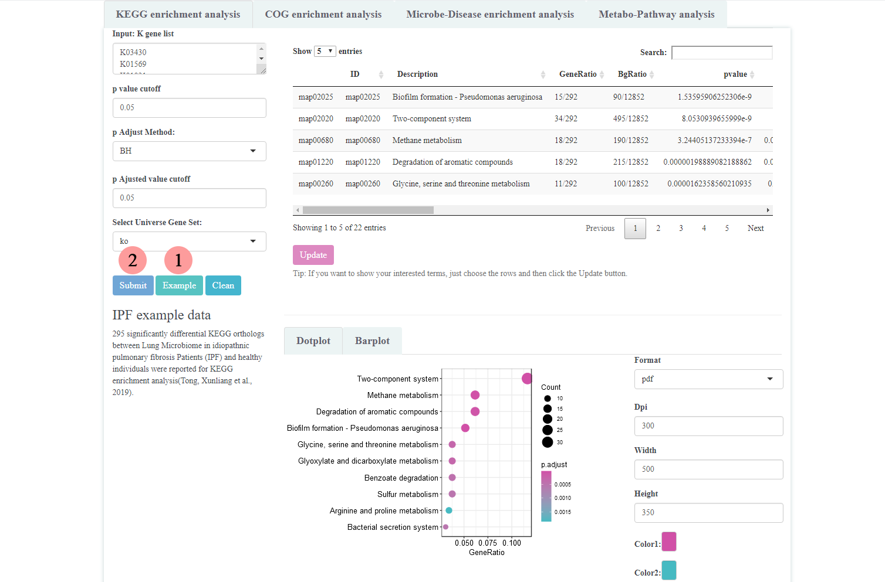
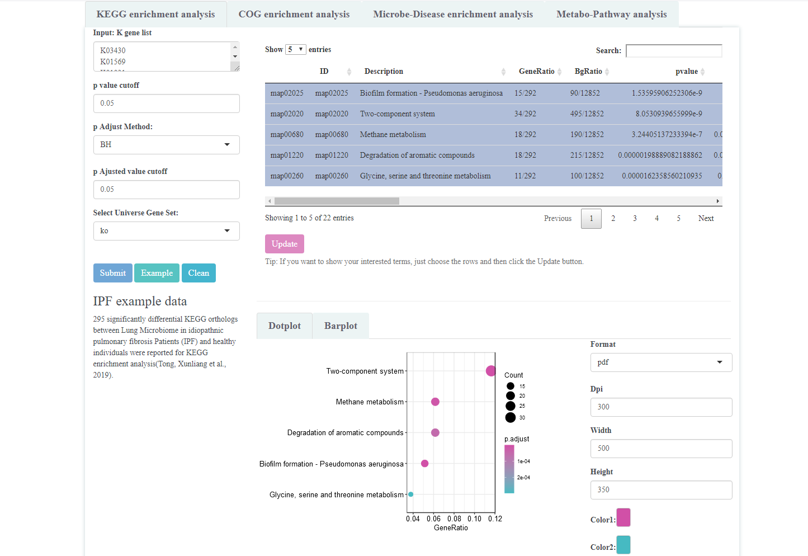

```{r, include = FALSE}
knitr::opts_chunk$set(
  collapse = TRUE,
  comment = "#>"
)
```
#  Install package
```{r eval = FALSE}
if (!require("BiocManager"))
    install.packages("BiocManager")
BiocManager::install("MicrobiomeProfiler")
```

# Introduction

`MicrobiomeProfiler` is a functional enrichment tool for microbiome data based `clusterProfiler`. It is an R/shiny package with user-friendly interface.

As showed in the following figure, the sidebar panel was the input options and the main panel was designed to show output results (Also can be seen in other analysis).

```{r, echo=FALSE, fig.width = 20, dpi=600, fig.align="center", fig.cap="**KEGG enrichment analysis**"}

```

# Getting Started Quickly

Run the application:
```
library(MicrobiomeProfiler)
run_MicrobiomeProfiler()

```

# Supported Analysis

Also, `MicrobiomeProfiler` provides several enrich functions for optional analysis.

+ KEGG enrichment analysis
+ COG enrichment analysis
+ Microbe-Disease enrichment analysis
+ Metabo-Pathway analysis

There are four reference gene catalogs collected from publications that can be used as universe for KEGG analysis in specific scenarios.

| Reference Gene Catalog | Description |
| ----------- | ----------- |
| human_gut2014 | Integrated non-redundant gene catalog of human gut microbiome published on Natrue Biotechnology in 2014 |
| human_gut2016   | Integrated non-redundant gene catalog of human gut microbiome published on Cell Systems in 2016 |
|human_skin |Integrated human skin microbial non-redundant gene catalog | |
|human_vagina | a comprehensive human vaginal non-redundant gene catalog (VIRGO) that includes 6751 KEGG orthology|

# Case Study

## Data input
 
To click the `Example` button, the example gene list would be showed in the input area. Also, more parameters can be set below the input area, for instance, p value cutoff. There is a customer_defined_universe choice for users to define the specific universe for enrichment analysis (Also for other enrichment analysis). After that, clicking the `Submit` button to process analysis. The `Clean` button was designed for cleaning the current results.

```{r, echo=FALSE, fig.width = 20, dpi=600, fig.align="center", fig.cap="**Customize the universe**"}


```
And then, the universe input box would be showed below.

## Run example
Here we showed the case study of example: **Comparative functional KEGG enrichment analysis between Lung Microbioe in IPF and Healthy Individuals**. 295 significantly differential KEGG orthologs between Lung Microbioe in idiopathnic pulmonary fibrosis Patients (IPF) and healthy individuals were reported for KEGG enrichment analysis.

```{r, echo=FALSE, fig.width = 20, dpi=600, fig.align="center", fig.cap="**Case study**"}

```

The default visualization results showed top 10 significant terms. In addition, users can click the interested terms on the table, and click the `Update` to get the results. Furthermore, there are some output settings to adjust the output figure. 

```{r, echo=FALSE, fig.width = 20, dpi=600, fig.align="center", fig.cap="**To show interested tetms**"}

```

# Annotation database

`MicrobiomeProfiler` has utilized four database.

+ KEGG database: Kyoto Encyclopedia of Genes and Genomes
+ COG database: Clusters of Orthologous Groups of proteins
+ Disbiome: Linking microbiome to disease
+ SMPDB: The Small Molecule Pathway Database

#  Session Information
```{r echo = FALSE}
sessionInfo()
```
