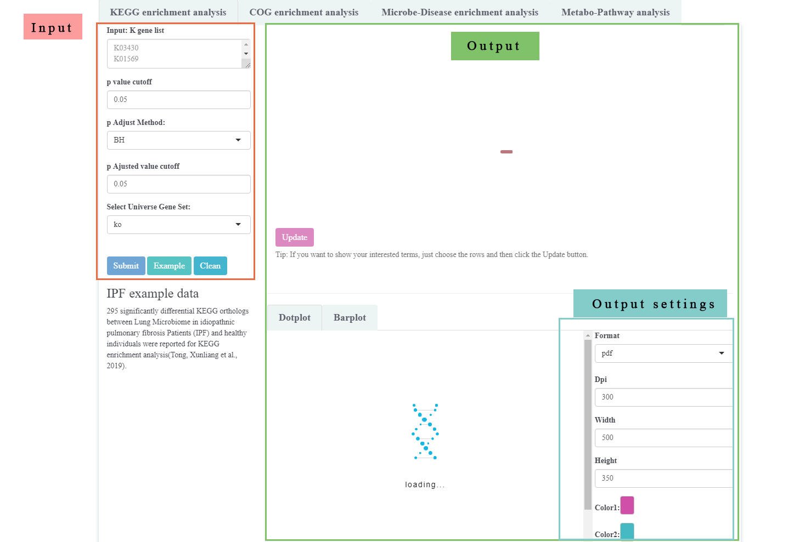
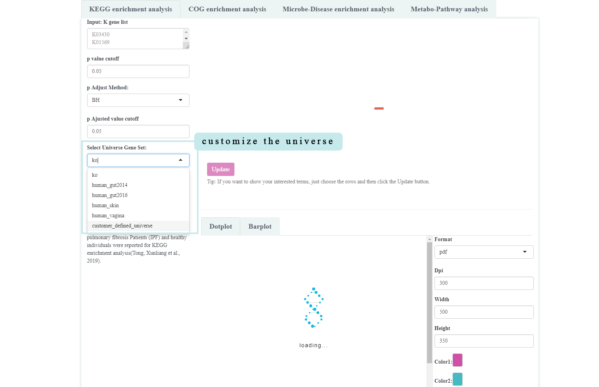
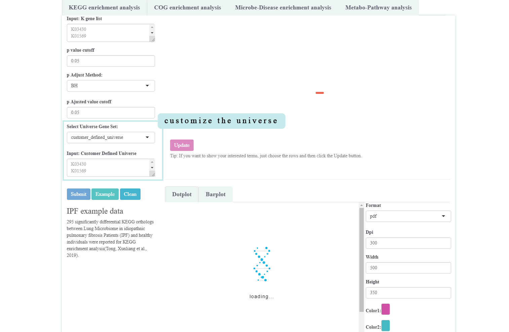
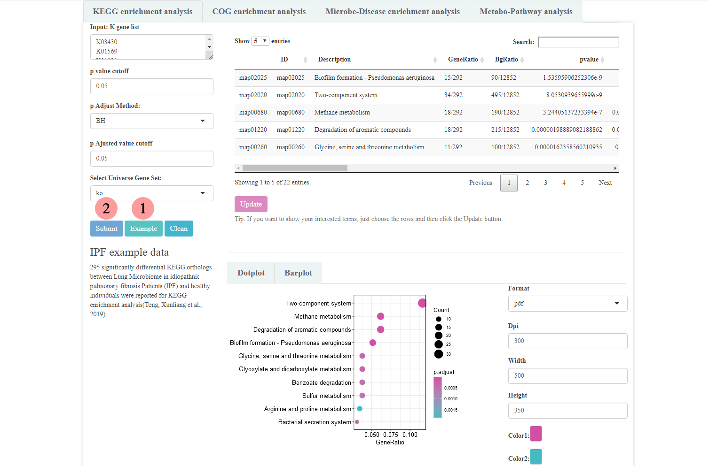
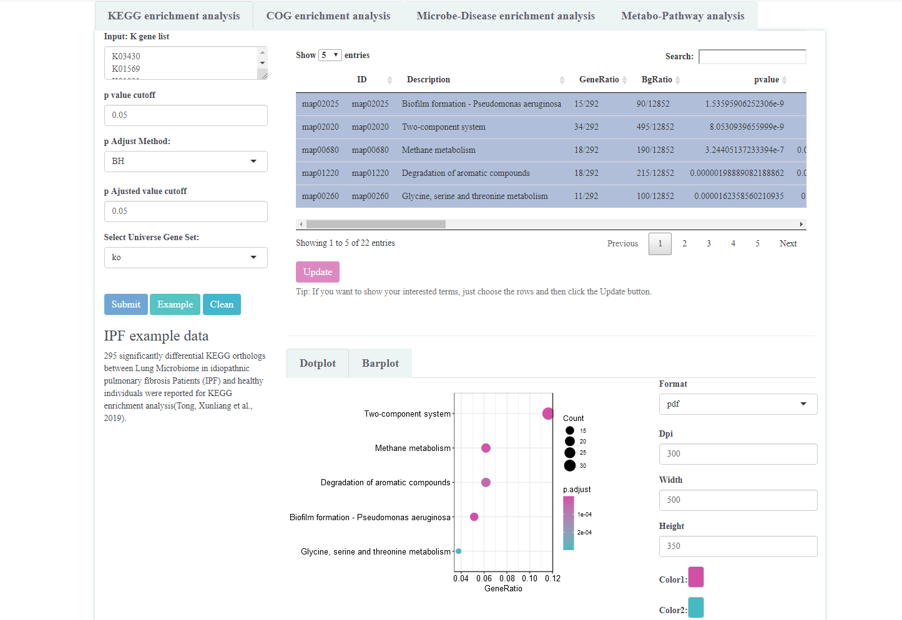

```{r, include = FALSE}
knitr::opts_chunk$set(
  collapse = TRUE,
  comment = "#>"
)
```
#  Install package
```{r eval = FALSE}
if (!require("BiocManager"))
    install.packages("BiocManager")
BiocManager::install("MicrobiomeProfiler")
```

# Introduction

`MicrobiomeProfiler` is a functional enrichment toolkit for microbiome data,
built on the `clusterProfiler` ecosystem. It ships both a set of programmatic
enrichment functions and an R/Shiny application with a user-friendly interface.

Annotation data is delivered in a hybrid way:

+ Stable, compact resources are bundled with the package.
+ Large or fast-moving resources are published on the package GitHub Pages site
  and downloaded on demand, then cached locally.
+ Cached artifacts can be refreshed independently from the package release
  cycle.

As shown in the following figure, the sidebar panel holds the input options and
the main panel shows the output (the same layout is used by every analysis).

```{r, echo=FALSE, fig.width = 20, dpi=600, fig.align="center", fig.cap="**KEGG enrichment analysis**"}

```

# Getting Started Quickly

Run the application:

```{r eval = FALSE}
library(MicrobiomeProfiler)
run_MicrobiomeProfiler()
```

The application provides three entry points:

+ `Gene enrichment analysis`
  + `KEGG`
  + `COG`
  + `eggNOG`, with both `ORA` and `GSEA` modes on the same page
+ `Microbe disease/signature enrichment`
  + `Disbiome`
  + `BugSigDB`
+ `Metabo-Pathway analysis`
  + `SMPDB.Metabolite.ID`
  + `KEGG.ID`
  + `HMDB.ID`

# Supported Analysis

`MicrobiomeProfiler` provides the following enrichment analyses:

+ KEGG enrichment and GSEA for microbiome gene profiles
+ COG enrichment and GSEA
+ eggNOG-based KEGG pathway enrichment (`enrichEggNOG()`) and GSEA (`gseEggNOG()`)
+ Microbe-disease enrichment with Disbiome (`enrichMDA()`, `gseMDA()`)
+ Microbial signature enrichment with BugSigDB (`enrichBugSigDB()`)
+ Metabolite pathway enrichment with SMPDB and HMDB (`enrichSMPDB()`,
  `enrichHMDB()`)

Where the analysis is defined over a background, the Shiny interface offers the
default background or a `customer_defined_universe` supplied by the user.

# Programmatic Usage

## KEGG and COG

```{r eval = FALSE}
library(MicrobiomeProfiler)

data(Rat_data)
ko_res <- enrichKO(Rat_data)

data(Psoriasis_data)
cog_res <- enrichCOG(Psoriasis_data, dtype = "pathway")
```

## eggNOG

`eggNOG` orthologous groups are used as the input identifiers. They are not
plain `OG0001`-style numbers: an identifier carries the gene name, the
taxonomic id and a suffix, for example `Collectrin@131567|A-1*`.

```{r eval = FALSE}
library(MicrobiomeProfiler)

og <- c(
    "Collectrin@131567|A-1*",
    "Collectrin@7711|C-2",
    "Collectrin@75365|II-17"
)

ora_res <- enrichEggNOG(og, minGSSize = 1, maxGSSize = 500)
```

`ORA` is the primary quick-start example for `eggNOG`. `GSEA` expects a named
ranked numeric vector of the same identifiers. A ranked list has to span more
than one pathway for the permutation p-values to be computable, so a handful of
identifiers taken from a single pathway is not enough to obtain a result; in the
Shiny app, the `Example` button of `eggNOG` + `GSEA` builds a ready-to-run
ranked list from the published annotation artifact.

```{r eval = FALSE}
geneList <- c(2.5, 1.5, -0.8)
names(geneList) <- og

gse_res <- gseEggNOG(geneList, minGSSize = 1, maxGSSize = 500, seed = TRUE)
```

## Microbe-Disease and Signature Enrichment

```{r eval = FALSE}
library(MicrobiomeProfiler)

data("microbiota_taxlist", package = "MicrobiomeProfiler")

bugsigdb_res <- enrichBugSigDB(microbiota_taxlist)
mda_res <- enrichMDA(microbiota_taxlist)
```

# Case Study

## Data input

Clicking the `Example` button fills the input area with a ready-to-run example
for the selected analysis. Further parameters can be set below the input area,
for instance the p value cutoff. There is a `customer_defined_universe` choice
for users who want to define a specific universe for the enrichment analysis
(this is also available for the other enrichment analyses). After that, click
`Submit` to run the analysis. The `Clean` button clears the current results.

```{r, echo=FALSE, fig.width = 20, dpi=600, fig.align="center", fig.cap="**Customize the universe**"}


```
And then, the universe input box would be showed below.

For `eggNOG` in `GSEA` mode, provide one ranked item per line, that is an
identifier and a numeric score separated by whitespace. The universe and the q
value cutoff do not apply in this mode.

## Run example
Here we showed the case study of example: **Comparative functional KEGG enrichment analysis between Lung Microbioe in IPF and Healthy Individuals**. 295 significantly differential KEGG orthologs between Lung Microbioe in idiopathnic pulmonary fibrosis Patients (IPF) and healthy individuals were reported for KEGG enrichment analysis.

```{r, echo=FALSE, fig.width = 20, dpi=600, fig.align="center", fig.cap="**Case study**"}

```

The default visualization results showed top 10 significant terms. In addition, users can click the interested terms on the table, and click the `Update` to get the results. Furthermore, there are some output settings to adjust the output figure. 

```{r, echo=FALSE, fig.width = 20, dpi=600, fig.align="center", fig.cap="**To show interested tetms**"}

```

# Annotation databases

`MicrobiomeProfiler` currently uses the following annotation resources:

+ KEGG database: Kyoto Encyclopedia of Genes and Genomes
+ COG database: Clusters of Orthologous Groups of proteins
+ eggNOG: evolutionary genealogy of genes: Non-supervised Orthologous Groups,
  mapped to KEGG pathways
+ Disbiome: linking microbiome to disease
+ BugSigDB: a manually curated database of microbial signatures
+ SMPDB: The Small Molecule Pathway Database
+ HMDB: The Human Metabolome Database

# External data delivery

Some annotation resources are distributed from the package GitHub Pages site
instead of being bundled directly in the package tarball. This keeps the
installed package smaller while allowing data artifacts to be refreshed
independently.

Currently configured external datasets are `bugsigdb`, `disbiome` and `eggnog`.

You can inspect them with:

```{r eval = FALSE}
library(MicrobiomeProfiler)

available_datasets()
available_datasets(include_remote = TRUE)
```

To pre-download a dataset into the local cache:

```{r eval = FALSE}
download_dataset("bugsigdb")
download_dataset("disbiome", refresh = TRUE)
download_dataset("eggnog")
```

To inspect or clear the local cache:

```{r eval = FALSE}
dataset_cache_info()
dataset_cache_info("bugsigdb")

clear_dataset_cache("bugsigdb")
clear_dataset_cache()
```

At runtime, `enrichBugSigDB()`, `enrichEggNOG()` and `gseEggNOG()` download
their external artifacts on demand, while `enrichMDA()` / `gseMDA()` use
remote-first Disbiome data with a fallback to the bundled internal dataset when
the remote resource is unavailable.

If the remote resource cannot be reached, `enrichEggNOG()` and `gseEggNOG()`
report the failure instead of silently analysing incomplete data, and the
`Example` button of the app reports that it could not build an example rather
than inserting placeholder identifiers.

#  Session Information
```{r echo = FALSE}
sessionInfo()
```
